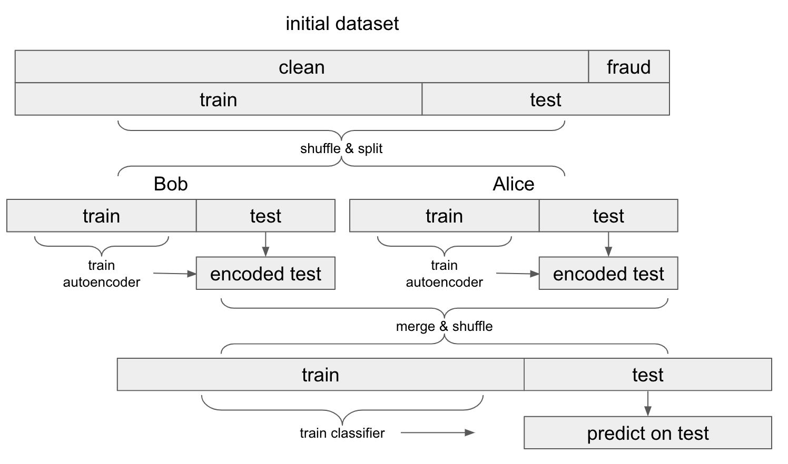

# NTROPY
### Task 3 :

Worldline has open sourced some of their data of credit card transactions to
try to predict fraud: https://www.kaggle.com/mlg-ulb/creditcardfraud

Imagine this dataset is cut in half horizontally. Alice has half of the data
and Bob has the other half. Neither of them wants to send their raw data to us.
However, we convince them to let our model learn from their data in a federated
setting. Implement a way for our model to train on the combined data of both
Alice and Bob without either of them sending us any raw data. Does your
approach have a quantifiable "privacy budget" (some approaches do, others don't)?
Compare the accuracy of this model with one which has access to all of the raw
data at once.

### Approach :
The idea is to find a way to transform the raw data both for Bob & Alice. An Autoencoder would behave like a dimension reduction, and hence transform the raw data, without loosing too much of the information it contains.

Training the autoencoder with only clean data (excluding fraud data) is helpful in order to behave like a novelty detection. the autoencoder will learn a representation of clean data, and since the same model will generate the representations of fraud data, they are likely to have a different output.

Once the autoencoder is trained, it is possible to encode the data on both sides independently. After that it is possible to concatenate both encrypted subsets into a single one, that is then used to train a classifier.

### Schema explaining the approach used :


### Results
- Result of the classifier trained on independently encrypted data :
```
Confusion matrix :
[[1246    1]
 [  21   85]]

Associated quality metrics :
              precision    recall  f1-score   support

           0       0.98      1.00      0.99      1247
           1       0.99      0.80      0.89       106

    accuracy                           0.98      1353
   macro avg       0.99      0.90      0.94      1353
weighted avg       0.98      0.98      0.98      1353

AUC score : 0.9005424339168722
```
  
- Result of the classifier trained on the raw data :
```
Confusion matrix :
[[1245    2]
 [  14   92]]

Associated quality metrics :
              precision    recall  f1-score   support
           0       0.99      1.00      0.99      1247
           1       0.98      0.87      0.92       106
    accuracy                           0.99      1353
   macro avg       0.98      0.93      0.96      1353
weighted avg       0.99      0.99      0.99      1353

AUC score : 0.9331603395318576
```
  
### Ideas to improve the method :
- Implement the variation of the autoencoder model detailed in the paper : [Batch Image Encryption Using Generated Deep Features Based on Stacked Autoencoder Network
](https://doi.org/10.1155/2017/3675459). This could enhance the encryption effect of the encoder.
- Find the right latent dimension for the autoencoder, so that the data is of a good enough quality without being too close to the raw data to ensure a decent encryption.
- Spend more time fine tuning both the autoencoder model (different activation functions, different network architecture) and the classifier (test and benchmark more models, with gridsearch & CV).
- Test in a context in which Alice & Bob really have independent data sources and see how some deeper differences between the datasets influence the results.
